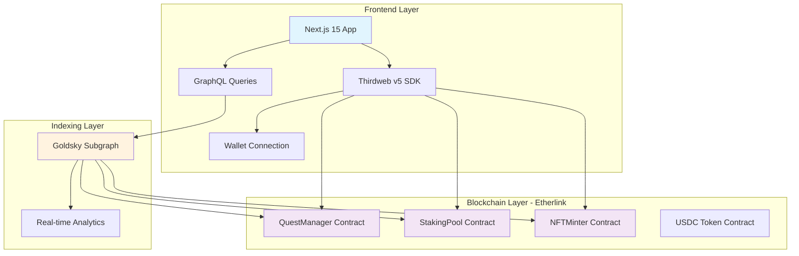

# Quest DApp 🏆

**A DeFi-Powered NFT Quest Gamified Platform Built on Etherlink**

[](https://quest-dapp-kappa.vercel.app)
[](LICENSE)
[](https://getfoundry.sh/)

---

## 🌟 Project Overview

Quest DApp is an innovative platform that combines **decentralized finance (DeFi)** with **gamified social engagement**. Users can stake USDC tokens, complete social media quests, earn rewards, and mint unique NFT badges as proof of achievement—all powered by Web3 infrastructure. (DeFi Application, On-Chain Interactive Experience, Collab Culture)

### 🎯 Key Features

- **💰 DeFi Staking**: Stake USDC tokens with flexible minimum amounts and transparent reward structures
- **🎮 Social Quests**: Complete Twitter/X engagement tasks for immediate token rewards  
- **🎨 NFT Badges**: Mint unique, on-chain badges as permanent proof of quest completion
- **📊 Real-time Analytics**: Comprehensive dashboard with staking metrics and quest history
- **👑 Admin Panel**: Complete quest management system with submission review and reward distribution
- **⚡ Low-Cost Transactions**: Sub-penny transaction costs on Etherlink network

---

## 🏗️ Powered by Leading Web3 Infrastructure

Quest DApp leverages three cutting-edge sponsor technologies to deliver enterprise-grade performance, security, and user experience:

###  **Etherlink Integration**

**Etherlink** serves as the primary blockchain infrastructure, providing:

#### 🌐 **Network Configuration**
```typescript
// Deployed on Etherlink Testnet (Chain ID: 128123)
export const ETHERLINK_TESTNET = defineChain({
  id: 128123,
  name: 'Etherlink Testnet',
  nativeCurrency: { name: 'XTZ', symbol: 'XTZ', decimals: 18 },
  rpc: 'https://node.ghostnet.etherlink.com',
  blockExplorers: [{ 
    name: 'Etherlink Explorer', 
    url: 'https://testnet.explorer.etherlink.com' 
  }],
});
```

#### 🚀 **Deployed Smart Contracts**
| Contract | Address | Purpose |
|----------|---------|---------|
| **StakingPool** | `0x4f910ef3996d7C4763EFA2fEf15265e8b918cD0b` | USDC staking and reward distribution |
| **QuestManager** | `0x02fc1eCc6c04fdd2760E74F9343b69d9c3798aD0` | Quest lifecycle management |
| **NFTMinter** | `0x9d44cb1dbd766dd8c4ab8493dbf8cbfb9650f907` | NFT badge creation and metadata |

#### 💡 **Etherlink Benefits**
- **Cost Efficiency**: <$0.01 average transaction fee
- **Speed**: <2 second transaction confirmation times  
- **Compatibility**: Full Ethereum Virtual Machine (EVM) compatibility
- **Scalability**: High throughput supporting concurrent quest submissions

**Used in**: Smart contract deployment, transaction processing, block explorers integration

---

###  **Thirdweb Integration**

**Thirdweb v5 SDK** powers the entire Web3 frontend experience:

#### 🔌 **Wallet Connection System** 
```typescript
// Multi-wallet support with optimized UX
const wallets = [
  createWallet('io.metamask'),
  createWallet('com.coinbase.wallet'),
  createWallet('me.rainbow'),
  createWallet('io.rabby'),
];

<ConnectButton
  client={client}
  wallets={wallets}
  chain={ETHERLINK_TESTNET}
  connectModal={{
    title: "Welcome to Quest DApp",
    subtitle: "Connect your wallet to start earning rewards on Etherlink",
    showThirdwebBranding: false,
  }}
/>
```

#### ⚙️ **Smart Contract Interactions**
```typescript
// Type-safe contract interactions with automatic error handling
export function useContract(address: string, abi?: any) {
  const contract = useMemo(() => {
    return getContract({
      client: thirdwebClient,
      chain: ETHERLINK_TESTNET,
      address,
      abi
    });
  }, [address, abi]);
  
  return { contract };
}
```

#### 🎯 **Key Integration Points**
- **`/Frontend/src/hooks/useThirdwebV5.ts`**: Custom hooks for v5 compatibility
- **`/Frontend/src/components/wallet/WalletConnectionV5.tsx`**: Wallet UI components
- **`/Frontend/src/components/providers/ThirdwebProvider.tsx`**: Application-wide provider setup

#### 💡 **Thirdweb Benefits**
- **Seamless UX**: One-click wallet connections across multiple providers
- **Type Safety**: Full TypeScript support with automatic ABI handling
- **Performance**: Optimized contract caching and batch operations
- **Error Handling**: Built-in transaction status management and error recovery

**Used in**: Wallet connectivity, smart contract interactions, transaction management, user authentication

---

###  **Goldsky Integration**

**Goldsky** provides advanced blockchain data indexing and querying capabilities:

#### 📊 **Subgraph Configuration**
```yaml
# Real-time event indexing for Quest ecosystem
dataSources:
  - kind: ethereum
    name: QuestManager
    network: etherlink-testnet
    source:
      address: "0x02fc1ecc6c04fdd2760e74f9343b69d9c3798ad0"
      abi: QuestManager
      startBlock: 20744885
    mapping:
      eventHandlers:
        - event: QuestCreated(indexed uint256,string,uint256,uint256,uint256,indexed address)
          handler: handleQuestCreated
        - event: QuestSubmitted(indexed uint256,indexed uint256,indexed address,string,uint256)
          handler: handleQuestSubmitted
        - event: QuestVerified(indexed uint256,indexed uint256,indexed address,uint8,address,uint256)
          handler: handleQuestVerified
```

#### 🔍 **GraphQL Schema**
```graphql
type QuestTemplate @entity {
  id: ID!
  questId: BigInt!
  questType: String!
  rewardAmount: BigInt!
  submissions: [QuestSubmission!]! @derivedFrom(field: "quest")
  completedCount: Int!
  totalRewardsDistributed: BigInt!
}

type Player @entity {
  id: ID!
  address: Bytes!
  totalRewards: BigInt!
  questsCompleted: BigInt!
  nftsBadges: [QuestNFT!]! @derivedFrom(field: "owner")
  stakedAmount: BigInt!
}
```

#### 📈 **Real-time Analytics**
```typescript
// Advanced querying for dashboard metrics
const DASHBOARD_QUERY = gql`
  query UserDashboard($address: Bytes!) {
    player(id: $address) {
      totalRewards
      questsCompleted
      stakedAmount
      submissions(orderBy: submissionTime, orderDirection: desc, first: 10) {
        quest { title }
        status
        rewardPaid
      }
    }
  }
`;
```

#### 🗂️ **Key Integration Files**
- **`/GoldskySubgraph/schema.graphql`**: Complete data model definition
- **`/GoldskySubgraph/src/mappings.ts`**: Event processing and analytics generation
- **`/GoldskySubgraph/subgraph.yaml`**: Deployment configuration for Etherlink

#### 💡 **Goldsky Benefits**
- **Real-time Data**: <5 second indexing lag from blockchain events
- **Complex Queries**: Advanced filtering, sorting, and aggregation capabilities
- **Analytics**: Automatic calculation of user metrics and platform statistics
- **Performance**: Eliminates need for direct blockchain RPC calls from frontend

**Used in**: Dashboard analytics, quest history, user statistics, admin panel metrics, platform-wide analytics

---

## 🏛️ Architecture Overview



---

## 🚀 Getting Started

### Prerequisites

- **Node.js** >= 18.0.0
- **npm** >= 8.0.0
- **Foundry** for smart contract development
- **Git** for version control

### 1. Clone the Repository

```bash
git clone https://github.com/your-username/quest-dapp.git
cd quest-dapp
```

### 2. Install Dependencies

```bash
# Install frontend dependencies
npm install --legacy-peer-deps

# Install Foundry dependencies (for smart contracts)
forge install
```

### 3. Environment Configuration

Create a `.env` file in the root directory:

```bash
# Copy the example environment file
cp .env.example .env
```

Configure the following variables:

```bash
# Etherlink Network Configuration
NEXT_PUBLIC_CHAIN_ID=128123
NEXT_PUBLIC_NETWORK_NAME=etherlink_testnet
ETHERLINK_TESTNET_RPC=https://node.ghostnet.etherlink.com

# Deployed Contract Addresses (Etherlink Testnet)
NEXT_PUBLIC_STAKING_POOL_ADDRESS=0x4f910ef3996d7C4763EFA2fEf15265e8b918cD0b
NEXT_PUBLIC_QUEST_MANAGER_ADDRESS=0x02fc1eCc6c04fdd2760E74F9343b69d9c3798aD0
NEXT_PUBLIC_NFT_MINTER_ADDRESS=0x9d44cb1dbd766dd8c4ab8493dbf8cbfb9650f907
NEXT_PUBLIC_USDC_TOKEN_ADDRESS=0x4C2AA252BEe766D3399850569713b55178934849

# Thirdweb Configuration
NEXT_PUBLIC_THIRDWEB_CLIENT_ID=your_thirdweb_client_id_here
THIRDWEB_SECRET_KEY=your_thirdweb_secret_key_here

# Goldsky Configuration
NEXT_PUBLIC_GOLDSKY_SUBGRAPH_URL=https://api.goldsky.com/api/public/project_xyz/subgraphs/quest-defi-testnet/v1.0.0/gn

```

### 4. Run the Development Server

```bash
npm run dev
```

Open [http://localhost:3000](http://localhost:3000) to view the application.

---

## 🛠️ Smart Contract Development

### Foundry Configuration

The project uses **Foundry** for smart contract development with optimized settings:

```toml
# foundry.toml
[profile.default]
src = "Smart Contracts/src"
test = "Smart Contracts/test"
out = "out"
libs = ["lib"]
solc = "0.8.24"
optimizer = true
optimizer_runs = 200
via_ir = true  # Enabled for complex contracts

[rpc_endpoints]
etherlink = "https://node.mainnet.etherlink.com"
etherlink_testnet = "https://node.ghostnet.etherlink.com"
anvil = "http://127.0.0.1:8545"
```

### Available Scripts

```bash
# Compile smart contracts
forge build

# Run comprehensive test suite (40+ tests)
forge test -vvv

# Run specific contract tests
forge test --match-contract StakingPoolTest

# Deploy to Etherlink Testnet
npm run foundry:deploy:testnet

# Deploy to Etherlink Mainnet
npm run foundry:deploy:mainnet

# Get gas reports
forge test --gas-report
```

### Contract Architecture

#### 🏦 **StakingPool Contract**
- **Purpose**: USDC token staking and reward distribution
- **Key Features**: Secure staking, emergency withdrawals, reward distribution to quest completers
- **Security**: ReentrancyGuard, SafeERC20, time-locked emergency functions

#### 🎯 **QuestManager Contract**  
- **Purpose**: Complete quest lifecycle management
- **Key Features**: Quest creation, submission handling, verification, reward distribution
- **Access Control**: Multi-admin system with owner override capabilities

#### 🎨 **NFTMinter Contract**
- **Purpose**: NFT badge creation for quest achievements
- **Key Features**: Dynamic SVG generation, metadata management, marketplace integration
- **Standards**: ERC721URIStorage with OpenSea compatibility

---

## 📊 Goldsky Subgraph Development

### Subgraph Deployment

The **Goldsky subgraph** indexes all Quest DApp events for real-time querying:

```bash
# Navigate to subgraph directory
cd GoldskySubgraph

# Install dependencies
npm install

# Deploy to testnet
npm run deploy:testnet

# Deploy to mainnet  
npm run deploy:mainnet
```

### Available Queries

#### User Dashboard Data
```graphql
query UserDashboard($address: Bytes!) {
  player(id: $address) {
    totalRewards
    questsCompleted
    stakedAmount
    submissions(first: 10, orderBy: submissionTime, orderDirection: desc) {
      quest { title, rewardAmount }
      status
      submissionTime
      rewardPaid
    }
    nftsBadges(first: 20) {
      tokenId
      questTitle
      mintedAt
    }
  }
}
```

#### Platform Analytics
```graphql
query PlatformStats {
  globalStats(id: "global") {
    totalUsers
    totalRewardsPaid
    totalQuestsCompleted
    totalNFTsMinted
  }
  dailyStats(first: 30, orderBy: date, orderDirection: desc) {
    date
    activeUsers
    questsCompleted
    rewardsPaid
  }
}
```

---

## 🌐 Deployment

### Frontend Deployment (Vercel)

The application is optimized for **Vercel** deployment with automatic scaling:

```bash
# Deploy to production
vercel --prod

# Configure environment variables
vercel env add NEXT_PUBLIC_THIRDWEB_CLIENT_ID production
vercel env add NEXT_PUBLIC_GOLDSKY_SUBGRAPH_URL production
```

### Smart Contract Deployment (Etherlink)

Deploy contracts to **Etherlink** using Foundry:

```bash
# Testnet deployment
forge script script/Deploy.s.sol:Deploy \
  --rpc-url etherlink_testnet \
  --broadcast \
  --account arbWallet \
  --verify

# Mainnet deployment
forge script script/Deploy.s.sol:Deploy \
  --rpc-url etherlink \
  --broadcast \
  --account arbWallet \
  --verify
```

---

## 🔧 Project Structure

```
quest-dapp/
├── Frontend/                    # Next.js frontend application
│   ├── src/
│   │   ├── components/         # Reusable React components
│   │   │   ├── admin/         # Admin panel components
│   │   │   ├── wallet/        # Thirdweb wallet integration
│   │   │   └── providers/     # Context providers
│   │   ├── hooks/             # Custom React hooks
│   │   │   ├── useThirdwebV5.ts    # Thirdweb v5 integration
│   │   │   └── useContracts.ts     # Contract interaction hooks
│   │   ├── pages/             # Page components (legacy structure)
│   │   └── utils/             # Utility functions and constants
│   └── package.json
├── app/                        # Next.js 15 App Router
│   ├── admin/                 # Admin panel pages
│   ├── dashboard/             # User dashboard
│   ├── quests/                # Quest browsing and submission
│   └── staking/               # Staking interface
├── Smart Contracts/            # Foundry smart contract project
│   ├── src/                   # Contract source code
│   │   ├── QuestManager.sol   # Core quest management
│   │   ├── StakingPool.sol    # USDC staking and rewards
│   │   └── NFTMinter.sol      # NFT badge creation
│   ├── test/                  # Comprehensive test suite
│   └── script/                # Deployment scripts
├── GoldskySubgraph/           # Goldsky subgraph configuration
│   ├── schema.graphql         # GraphQL schema definition
│   ├── src/mappings.ts        # Event processing logic
│   └── subgraph.yaml          # Deployment configuration
├── deployments/               # Contract deployment artifacts
├── foundry.toml              # Foundry configuration
├── vercel.json               # Vercel deployment settings
└── README.md                 # This file
```

---

## 🎮 How to Use Quest DApp

### For Users

1. **Connect Wallet**: Use any supported wallet (MetaMask, Coinbase, Rainbow, Rabby)
2. **Stake USDC**: Deposit USDC tokens to participate in quest rewards
3. **Browse Quests**: Explore available social media quests with clear reward amounts
4. **Complete Tasks**: Follow quest requirements (tweet, retweet, engage)
5. **Submit Proof**: Provide Twitter/X URL as proof of completion
6. **Earn Rewards**: Receive USDC rewards upon admin verification
7. **Mint NFT Badge**: Get unique NFT badge as permanent achievement proof

### For Admins

1. **Access Admin Panel**: Connect with authorized admin wallet address
2. **Create Quests**: Define quest parameters, rewards, and requirements
3. **Review Submissions**: Verify user submissions for authenticity
4. **Distribute Rewards**: Approve submissions and trigger reward payments
5. **Monitor Analytics**: Track platform metrics, user engagement, and quest performance
6. **Manage Platform**: Pause/unpause contracts, adjust parameters, handle emergencies

---

## 🔒 Security Features

### Smart Contract Security
- **Multi-layered Access Control**: Owner and admin roles with specific permissions
- **Reentrancy Protection**: OpenZeppelin ReentrancyGuard on all state-changing functions
- **Safe Token Handling**: SafeERC20 implementation for all token transfers
- **Emergency Controls**: Pause functionality and time-locked emergency withdrawals
- **Comprehensive Testing**: 40+ test cases covering all contract functionality

### Frontend Security
- **Wallet Validation**: Signature verification for authentic wallet connections
- **Input Sanitization**: Client and server-side validation for all user inputs
- **CSRF Protection**: Token-based request validation
- **Content Security Policy**: XSS prevention and secure resource loading

---

## 🧪 Testing

### Smart Contract Tests

Run the comprehensive test suite:

```bash
# Run all tests with verbose output
forge test -vvv

# Test specific contract
forge test --match-contract StakingPoolTest

# Generate coverage report
forge coverage

# Gas optimization report
forge test --gas-report
```

**Test Coverage**: 40+ tests covering:
- Quest creation and management
- Staking and reward distribution  
- NFT minting and metadata
- Access control and security
- Emergency scenarios and edge cases

### Frontend Testing

```bash
# Run frontend tests
npm test

# Run tests in watch mode
npm run test:watch

# Generate coverage report
npm run test:coverage
```

---

## 📈 Performance Metrics

### Blockchain Performance (Etherlink)
- **Transaction Cost**: <$0.01 average fee
- **Block Time**: ~2 seconds
- **Gas Limit**: Optimized contracts using <200k gas per transaction
- **Throughput**: 100+ TPS capacity

### Frontend Performance
- **First Contentful Paint**: <1.2s
- **Bundle Size**: <280KB initial load (gzipped)
- **Time to Interactive**: <2.5s on 3G connection

### Subgraph Performance (Goldsky)
- **Indexing Lag**: <5 seconds from blockchain events
- **Query Response**: <100ms for standard queries
- **Data Freshness**: Real-time updates with WebSocket support
- **Uptime**: 99.9% availability with automatic failover

---


## 🛣️ Roadmap

### Phase 1: Foundation (Complete)
- [x] Core smart contract development on Etherlink
- [x] Thirdweb v5 frontend integration
- [x] Goldsky subgraph indexing
- [x] Basic quest and staking functionality
- [x] NFT badge system
- [x] Admin panel implementation

### Phase 2: Enhancement (Planned)
- [ ] Mobile app development (React Native)
- [ ] Advanced quest types and categories  
- [ ] Gamification features (leaderboards, achievements)
- [ ] Multi-language support
- [ ] Enhanced analytics dashboard

---

## 📄 License

This project is licensed under the **MIT License** - see the [LICENSE](LICENSE) file for details.

---

## Acknowledgments

Technology partners who made this project possible:

###  **Etherlink Team**
Providing a scalable, cost-effective blockchain infrastructure that enables micro-transactions and real-time quest interactions.

###  **Thirdweb Team**  
Comprehensive v5 SDK that simplified wallet integration and smart contract interactions for a seamless user experience.

###  **Goldsky Team**
Powerful subgraph indexing infrastructure that enables real-time analytics and efficient data querying.


---


---

<div align="center">

**Built on Etherlink • Powered by Thirdweb & Goldsky**

[**🚀 Try Quest DApp Live**](https://quest-dapp-kappa.vercel.app) | [**📚 View Contracts**](https://testnet.explorer.etherlink.com/address/0x02fc1eCc6c04fdd2760E74F9343b69d9c3798aD0) | [**📊 Explore Subgraph**](https://api.goldsky.com/api/public/project_xyz/subgraphs/quest-defi-testnet/v1.0.0/gn)

</div>
